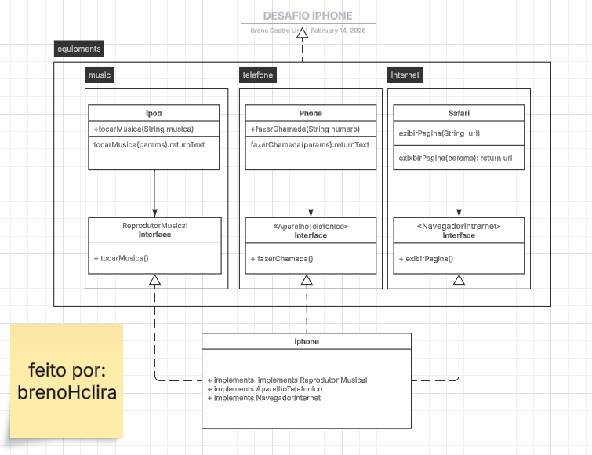

# Desafio Iphone POO

## Esse projeto faz parte do Desafio de POO - Progamação Orientada Objeto do Formação Java da DIO.me

O desafio lançado consiste em assitir a uma palestra do lançamento do IPHONE em 2007 com Steve Jobs. Depois construir uma aplicação em java com pacotes e classes de três produtos Ipod, NavegadorInternet e Telefone, cujas funções foram englobadas por um único aparelho em lançamento naquela ocasião, o Iphone. Paéis distintos dentro de um aparelho só.

### como fiz:
Primeiramente, criei os pacotes para conter os aparelhos por função "equipments" >  
".music",  
".internet",  
".telefone".

Dentro desses pacotes, coloquei contratos chamados Interfaces, cujo conteúdo consiste em funções anônimas genéricas de cada aparelho: NavegadorInternet, ReprodutorMusical e AparelhoTelefonico. Coloquei uma função que cada aparelho é capaz de fazer só para testar a lógica.

- exibirPagina(String url) - Navegador
- tocarMusica(String musica) - Reprodutor
- fazerChamada(String numero) - Telefone

Em seguida, coloquei as classes dos aparelhos Ipod, Safari e Phone. essas classes possuem métodos @override oriundos da Interface da qual cada um implementa. Esses métodos próprios definem seus comportamentos no contexto da classe de cada aparelho e são conectadas às Interface através da propriedade Implements.

Por fim, criei uma classe chamada Iphone para representar a revolução que houve naquela ano. O Iphone, então precisa ser capaz de assumir comportamentos de todos os demais aparelhos ja citados até aqui. Para tanto, criei um objeto Iphone e implementei as Interfaces dos outros objetos Ipod, Safari, Telefone. Dessa maneira o objeto Iphone foi capaz de herdar as funções dos outros aparelhos através da implementaçao das interfaces particulares dos aparelhos no Iphone.

Resumindo, o Iphone naquele ano foi capaz de juntar todas as funcionalidades dos demais aparelhos nele mesmo. Foi uma revolução que procurei retratar aqui por meio da Programação Orientada a Objetos. Para tanto foi melhor lançar mão das Interfaces ao invés de Heranças de Classes abstratas.
